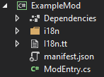

**ModTranslationClassBuilder** autogenerates a strongly-typed class to access [`i18n`
translation files](https://stardewvalleywiki.com/Modding:Modder_Guide/APIs/Translation)
from your [SMAPI](https://smapi.io/) mod code.

## Contents
* [Why does this exist?](#why-does-this-exist)
* [Usage](#usage)
  * [First-time setup](#first-time-setup)
  * [Update the file](#update-the-file)
  * [Conventions](#conventions)
* [Customization](#customization)
  * [File name & location](#file-name--location)
  * [Builder arguments](#builder-arguments)
* [See also](#see-also)

## Why does this exist?
<dl>
<dt>Without the package:</dt>
<dd>

Mods use code like this to read their translations:
```c#
string text = helper.Translation.Get("range-value", new { min = 1, max = 5 });
```

Unfortunately there's no validation at this point; if the key is `range` (not `range-value`) or the
token name is `minimum` (not `min`), you won't know until you test that part of the mod in-game and
see an error message.

That also means that after changing the translation files, you need to manually search the code for
anywhere that referenced the translations to update them. That gets pretty tedious with larger
mods, which might have hundreds of translations used across dozens of files.

</dd>
<dt>With the package:</dt>
<dd>

This package lets you write code like this instead:
```c#
string text = I18n.RangeValue(min: 1, max: 5);
```

Since it's strongly typed, it's validated immediately as you type. For example, if you accidentally
typed `I18n.RangeValues` instead, you'll see an immediate error that `RangeValues` doesn't exist
without needing to test it in-game (or even compile the mod).

</dd>
</dl>

See the [test mod](TestMod) for an example of the generated class in an actual mod.

## Usage
### First-time setup
1. [Install the NuGet package](https://www.nuget.org/packages/Pathoschild.Stardew.ModTranslationClassBuilder).
2. Build your mod project (so the package is in your build output).
  * **This must be done first, otherwise you'll be unable to build the project or generate the template succesfully**
3. Right-click the project, choose _Add > New Item_, and add a "Text Template" file named `I18n.tt`:  
   
4. Replace the new file's content with this:
   ```
   <#@ template hostspecific="true" language="C#" #>
   <#@ output extension=".cs" #>
   <#@ assembly name="$(TargetDir)\Pathoschild.Stardew.ModTranslationClassBuilder.dll"#>
   <#@ import namespace="Pathoschild.Stardew.ModTranslationClassBuilder" #>
   <#=
   TranslationClassBuilder.Generate(
       jsonPath: this.Host.ResolvePath("i18n/default.json")
   )
   #>
   ```
5. In your mod's `Entry` method, add this line:
   ```c#
   I18n.Init(helper.Translation);
   ```

That's it! When you save the file, it should automatically generate the `I18n` class. (It'll be
tucked under the `I18n.tt` file in the Solution Explorer.)

### Update the file
Just save the `I18n.tt` file again (no changes needed), and it'll regenerate the `I18n` class from
your latest `i18n/default.json` file.

### Conventions
* The class uses the correct namespace based on your project settings and its location within the
  project.

* Translation keys are converted to CamelCase, with `.` changed to `_` to help group categories.

  For example:

  key in `i18n/default.json` | method name
  -------------------------- | -----------
  `ready`                    | `Ready`
  `ready-now`                | `ReadyNow`
  `generic.ready-now`        | `Generic_ReadyNow`

## Customization
### File name & location
You can use any name for the `.tt` file (it doesn't need to be `I18n.tt`), and you can put it
anywhere in the project (it doesn't need to be at the root). Just make sure to change the `jsonPath`
value if you move it.

### Builder arguments
You can pass arguments to the `Generate` method in the `.tt` file to change how the class is
generated.

argument      | description
------------- | -----------
`jsonPath`    | _(required)_ The absolute path to the `i18n/default.json` file for which to generate the class.
`className`   | Default `I18n`. The name of the class to generate.
`classModifiers` | Default `internal static`. Change the [access modifiers](https://docs.microsoft.com/en-us/dotnet/csharp/programming-guide/classes-and-structs/access-modifiers) applied to the class (e.g. to make it public).
`addGetByKey` | Default `false`. Whether to add a method to fetch a translation by its key, like `I18n.GetByKey("ready-now")`.
`addKeyMap`   | Default `false`. Whether to add a nested static class to access translation keys like `I18n.Keys.ReadyNow`.

## See also
* [Release notes](release-notes.md)
